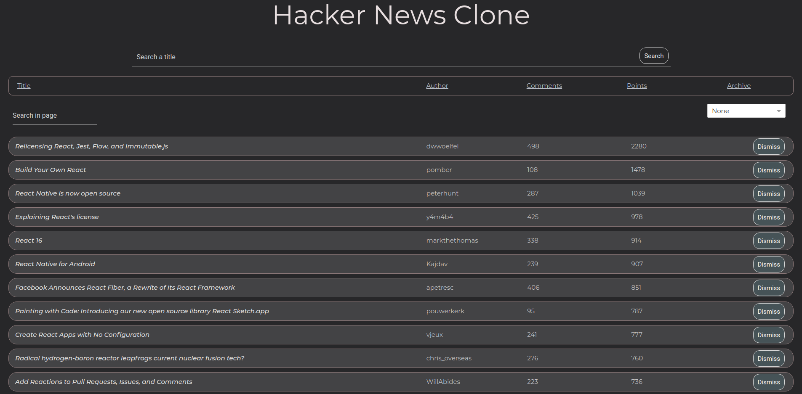

# Hacker News Clone



A web app built using **React** that can be used to fetch and read tech related news from over the internet.
This is a clone of the hacker news website and uses the Hacker News API.
[This](https://hn.algolia.com/api/v1) is the API used.

## Getting Started

Install all the dependecies from package.json using-

```
npm install
```
(or)
```
yarn install
```

## Built Using

* HTML
* CSS
* React
* Javascript
* Materialize CSS

## Dependencies

* react-dom
* react-scripts
* react
* prop-types
* axios
* lodash
* react-select

(This app isnt responsive and mobile friendly yet, changes will be made soon.)
